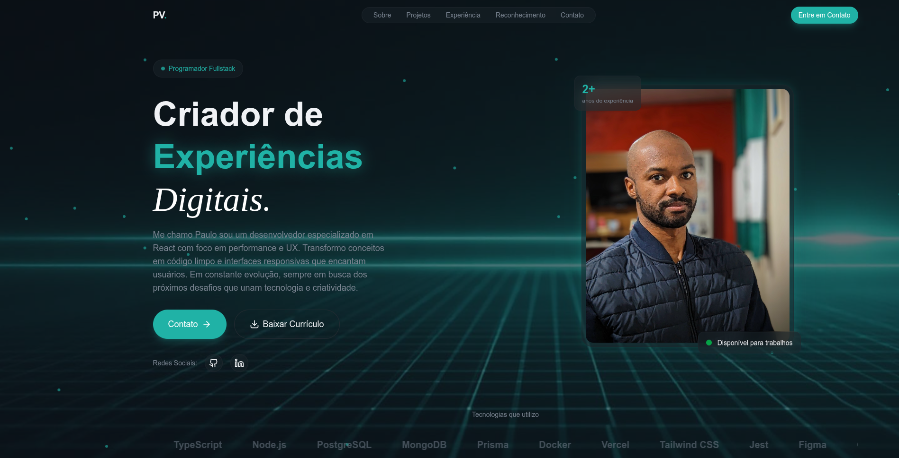

<p align="center">
  
  
  
  
</p>

# React Tailwind Portfolio

**React Tailwind Portfolio** é um portfólio pessoal desenvolvido com React e Tailwind CSS, combinando efeitos visuais sofisticados com uma experiência de usuário excepcional.

O projeto destaca-se pela qualidade das animações customizadas e pela apresentação estratégica de competências profissionais.

## Tecnologias

Este projeto foi construído com as seguintes tecnologias:

- **[React](https://react.dev/)** - Biblioteca para construção de interfaces de usuário.
- **[JavaScript](https://developer.mozilla.org/pt-BR/docs/Web/JavaScript)** - Linguagem de programação.
- **[Vite](https://vitejs.dev/)** - Build tool e dev server de última geração.
- **[Tailwind CSS](https://tailwindcss.com/)** - Framework CSS utility-first.
- **[Lucide React](https://lucide.dev/)** - Biblioteca de ícones moderna e consistente.
- **[Prettier](https://prettier.io/)** - Formatador de código.
- **[ESLint](https://eslint.org/)** - Linter de código.
- **[Bun](https://bun.sh/)** - Runtime JavaScript de alta performance.
- **[Git](https://git-scm.com/)** - Controle de versão.

## Demonstração

<a href="https://github.com/paulopbi/react-tailwind-portfolio" target="_blank" rel="noopener noreferrer">
  
</a>

> Clique na imagem para abrir o repositório.

## Funcionalidades

### Arquitetura & Organização
- **Estrutura Modular**: Separação clara entre componentes, constantes, hooks e utilidades.
- **Clean Code**: Organização de pastas intuitiva que facilita manutenção e escalabilidade.

#### Animações Customizadas
- **Marquee Effect**: Textos deslizantes com movimento contínuo e suave.
- **Fade In/Out**: Transições elegantes em diversos elementos da página.
- **Pulse Animation**: Efeitos pulsantes para destacar elementos importantes.
- **Particle System**: Sistema de partículas com movimento aleatório e orgânico.

### Componentes Interativos
- **Navbar Inteligente**: 
  - Responsiva com menu hamburger em mobile.  
  - Background dinâmico ativado no scroll.
  - Transições suaves entre estados.
- **Timeline de Experiências**: Componente visual para apresentar trajetória profissional de forma cronológica.
- **Carrossel de Depoimentos**: Sistema de navegação fluida para exibir testimonials.
- **Formulário de Contato**: Interface integrada para comunicação direta via email.

### Design System
- **Padronização Completa**: Cores, tipografia e espaçamentos consistentes.
- **Responsividade Total**: Layout adaptável para mobile, tablet e desktop.
- **Acessibilidade**: Desenvolvido seguindo boas práticas de acessibilidade web.

## Estrutura Visual

O portfólio está dividido em seções estratégicas:

- **Hero**: Apresentação impactante com animações de entrada.
- **Sobre**: Introdução profissional e habilidades.
- **Projetos**: Showcase de trabalhos realizados.
- **Experiência**: Timeline com histórico de carreira.
- **Reconhecimento**: Sessão de depoimentos.
- **Contato**: Formulário de contato.

## Como executar

Execute esses passos no seu terminal:

```shell
# Clone o repositório
git clone https://github.com/paulopbi/react-tailwind-portfolio

# Entre na pasta
cd react-tailwind-portfolio

# Instale as dependências
bun install

# Execute o projeto localmente
bun run dev
```

## Licença 

Este projeto está sob a licença MIT, veja o arquivo [LICENSE](./LICENSE) para mais detalhes.
